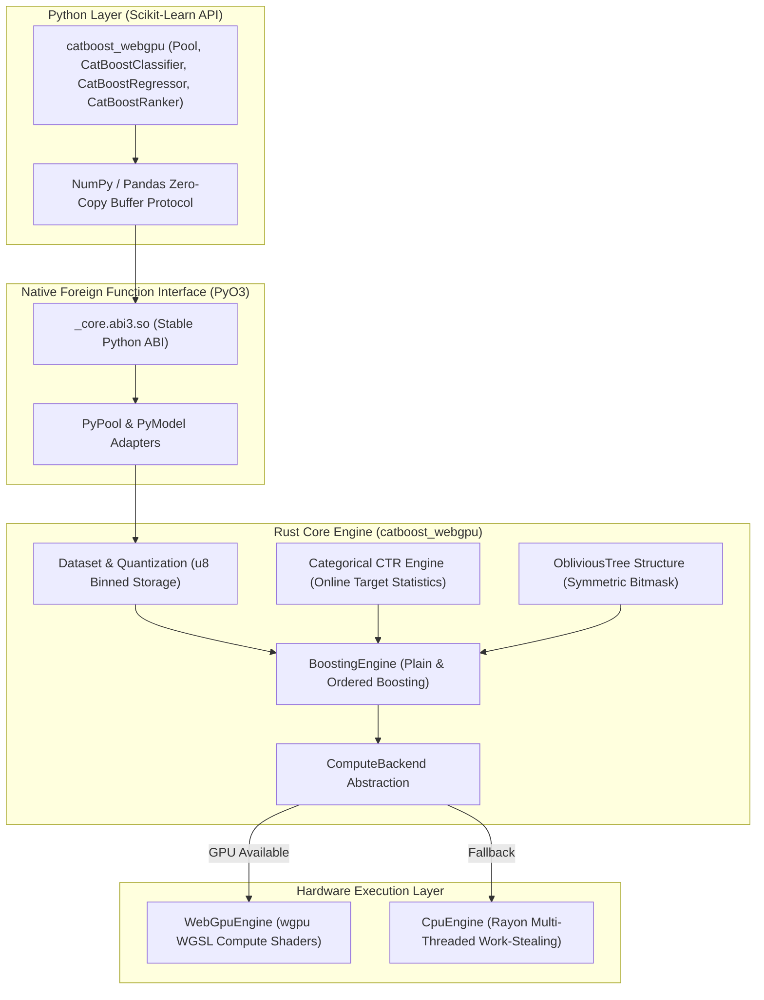

# Architecture & Design

`catboost-webgpu` is architected from the ground up to combine the mathematical rigor of the CatBoost gradient boosting algorithm with modern heterogeneous GPU compute. This document explores the architectural design, memory layouts, oblivious tree execution model, and compute abstractions.

---

## 1. System Topology & Layered Architecture

The framework is partitioned into three decoupled layers:



1. **Python API Layer (`python/catboost_webgpu/`)**: Provides drop-in Scikit-Learn estimators (`CatBoostClassifier`, `CatBoostRegressor`, `CatBoostRanker`), dataset encapsulation (`Pool`), and automated cross-validation (`cv`). It communicates directly with the native layer via NumPy memory buffers without serializing data to disk.
2. **PyO3 Native Bridge (`src/lib.rs`)**: Compiled with the Python Stable ABI (`abi3-py310`), allowing a single binary wheel to run across Python 3.10, 3.11, 3.12, 3.13, and future Python minor releases without recompilation.
3. **Core Rust Engine (`src/`)**: Implements strict ownership, zero-copy memory layouts, and thread safety. All core tree building, split searching, categorical encoding, and loss calculations are strictly verified at compile-time.
4. **Hardware Acceleration Layer**: The `ComputeBackend` trait cleanly isolates boosting algorithms from the compute backend, routing workgroup dispatches to either WebGPU or multi-core Rayon.

---

## 2. Oblivious Decision Trees vs. Asymmetric Trees

Traditional gradient boosted decision tree libraries (such as standard XGBoost or LightGBM) build **asymmetric decision trees** using depth-wise or leaf-wise (loss-guide) growth:

```
Asymmetric Tree (Standard GBDT):
             [X0 > 1.5]
            /          \
      [X2 > 0.8]     [X1 > 3.2]
       /      \       /      \
     L0        L1   [X0 > 0.2] L3
                    /        \
                   L2a       L2b
```

In contrast, **CatBoost** uses **Oblivious Decision Trees (ODTs)**, also known as Symmetric Trees. In an oblivious tree, all nodes at depth level $d$ share the **exact same split predicate**:

```
Oblivious Decision Tree (catboost-webgpu):
Level 0:                 [ Feature 3 > 1.25 ]
                         /                  \
Level 1:       [ Feature 0 > 0.40 ]    [ Feature 0 > 0.40 ]
                 /            \            /            \
Level 2:   [ F1 > 8.0 ]   [ F1 > 8.0 ] [ F1 > 8.0 ]   [ F1 > 8.0 ]
           /    \         /    \       /    \         /    \
Leaf:     L0    L1       L2    L3     L4    L5       L6    L7
```

### Architectural Advantages of Oblivious Trees

1. **Massive Memory Efficiency**:
   - An asymmetric tree of depth $D$ must store up to $2^D - 1$ distinct split conditions and pointer structures.
   - An oblivious tree of depth $D$ requires storing **only $D$ split conditions** and exactly $2^D$ leaf weights.
   - For depth $D = 6$, an oblivious tree stores 6 split tests and 64 leaf floats (a few hundred bytes total), easily fitting into CPU L1 cache and GPU register memory.

2. **Branchless $O(D)$ Evaluation via SIMD Bitmasks**:
   - Because split tests at depth $d$ are uniform across all nodes, evaluating the leaf index for a sample requires zero tree traversal or pointer chasing.
   - Each level test evaluates to a binary boolean (0 or 1). Shifting this boolean by level index $d$ and accumulating across depth yields the exact leaf index directly:
   $$\text{Leaf Index}(x) = \sum_{d=0}^{D-1} \left( \mathbb{I}\left[ x_{f_d} > t_d \right] \ll d \right)$$

In Rust, this branchless evaluation is implemented in [`src/traits.rs`](file:///home/kamonashis/Desktop/Projects/catboost-webgpu/src/traits.rs):
```rust
#[inline]
pub fn predict_leaf_binned(&self, binned_sample: &[u8]) -> usize {
    let mut leaf = 0usize;
    for (d, split) in self.splits.iter().enumerate() {
        if binned_sample[split.feature_idx] > split.bin_threshold {
            leaf |= 1 << d;
        }
    }
    leaf
}
```

3. **Zero GPU Branch Divergence**:
   - On GPU architectures (NVIDIA warps, AMD wavefronts, Apple SIMD groups), threads in a 32-thread or 64-thread execution group execute instructions in lockstep.
   - In asymmetric trees, different samples follow different branches, causing **branch divergence** where execution paths must be serialized, wasting 50% to 80% of GPU compute capacity.
   - In oblivious trees, **every single thread in the workgroup evaluates the identical feature index and split threshold simultaneously**. There is zero warp divergence during tree inference and prediction updates.

4. **Inherent Regularization**:
   - Symmetric structure acts as a strong structural regularizer, effectively eliminating overfitting on noisy tabular datasets where asymmetric trees memorize spurious deep patterns.

---

## 3. Data Representation & Quantization Engine

To maximize GPU memory bandwidth and cache locality, `catboost-webgpu` bins continuous 32-bit floating-point features into compact unsigned 8-bit integers (`u8`), accommodating up to 254 border splits per feature:

- **Row-Major Layout**: The training matrix is stored in contiguous row-major `[num_samples, num_features]` format for rapid sample-wise lookups.
- **Quantization Algorithms**: Implemented in [`src/quantization.rs`](file:///home/kamonashis/Desktop/Projects/catboost-webgpu/src/quantization.rs):
  - **GreedyLogSum**: Maximizes mutual information between split boundaries and empirical distribution.
  - **Uniform**: Equidistant border spacing between feature minimum and maximum.
  - **Median (Quantile)**: Quantile-based partitioning placing an equal number of samples in each bin.
  - **UniformAndQuantiles**: Hybrid approach combining quantile density with uniform tails.

This 4x compression ratio (from 32-bit float to 8-bit unsigned integer) allows millions of training samples to reside entirely in high-speed GPU VRAM.

---

## 4. ComputeBackend Trait Abstraction

Hardware independence is enforced via the `ComputeBackend` trait defined in [`src/traits.rs`](file:///home/kamonashis/Desktop/Projects/catboost-webgpu/src/traits.rs):

```rust
pub trait ComputeBackend: Send + Sync {
    /// Identifier of the compute device (e.g., "WebGPU: AMD Radeon Graphics" or "CPU (Rayon)").
    fn name(&self) -> &str;

    /// Is this backend WebGPU-accelerated?
    fn is_gpu(&self) -> bool;

    /// Accumulates 2D gradient and hessian histograms across all leaves and feature bins.
    fn compute_histograms(
        &self,
        binned_data: &[u8],
        leaf_indices: &[u32],
        gradients: &[f32],
        hessians: &[f32],
        num_samples: usize,
        num_features: usize,
        num_leaves: usize,
        max_bins: usize,
    ) -> Vec<f32>;

    /// Partitions sample leaf indices in-place when a split is chosen.
    fn partition_leaves(
        &self,
        binned_data: &[u8],
        leaf_indices: &mut [u32],
        feature_idx: usize,
        bin_threshold: u8,
        depth: usize,
        num_samples: usize,
        num_features: usize,
    );

    /// Vectorized in-place update of raw sample predictions.
    fn update_predictions(
        &self,
        predictions: &mut [f32],
        leaf_indices: &[u32],
        leaf_values: &[f32],
        learning_rate: f32,
    );
}
```

Both `WebGpuEngine` (`src/gpu_engine.rs`) and `CpuEngine` (`src/cpu_engine.rs`) implement this identical contract. If WebGPU initialization encounters an environment without GPU compute support, the boosting engine switches instantly to `CpuEngine` without modifying state or algorithms.
