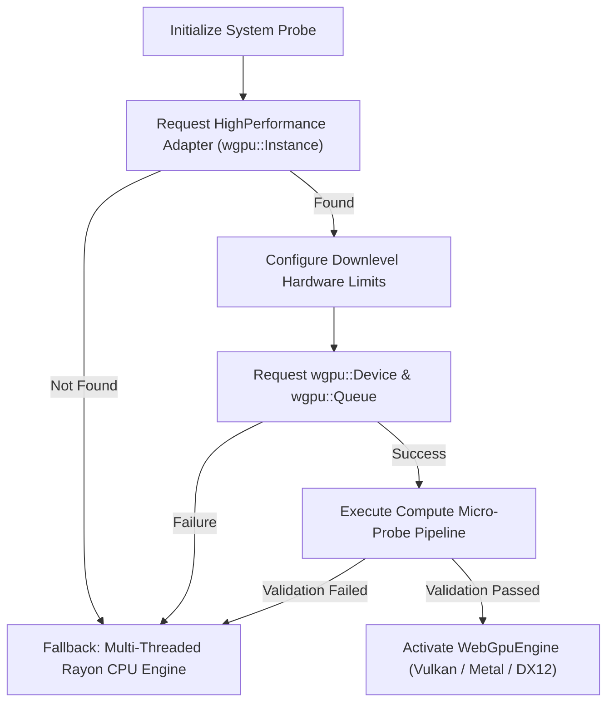

# WebGPU Acceleration & Compute Pipelines

`catboost-webgpu` leverages the cross-platform WebGPU compute standard (`wgpu 24.0`) to provide native hardware acceleration on modern GPUs. Unlike proprietary frameworks that require CUDA, `catboost-webgpu` dispatches compute pipelines across Vulkan, Metal, and DirectX 12 through portable WebGPU Shading Language (WGSL) shaders.

---

## 1. Hardware Discovery & Zero-Configuration Fallback

Hardware discovery is managed in [`src/device.rs`](file:///home/kamonashis/Desktop/Projects/catboost-webgpu/src/device.rs) through an automatic multi-stage probe:



### The Micro-Probe Verification Routine

Modern GPU drivers occasionally encounter driver instability or permission sandboxing in restricted environments. Rather than crashing during training, `catboost-webgpu` executes a lightweight compute verification shader immediately upon device acquisition:

1. Allocates a small storage buffer containing test data (`[1.0, 2.0, 3.0, 4.0]`).
2. Dispatches a simple micro-probe compute shader that multiplies elements by $2.0$.
3. Maps a staging buffer to host memory and asserts the result is `[2.0, 4.0, 6.0, 8.0]`.
4. If this probe succeeds, the device context is cached globally via `OnceLock<Option<GpuContext>>`.
5. If the probe fails, the engine logs a diagnostic warning and immediately activates `CpuEngine`.

The user never needs to supply `task_type="GPU"` or specify device indices.

---

## 2. WGSL Compute Shaders Architecture

The core boosting iterations are offloaded to 5 specialized WGSL compute shaders located in [`src/shaders/`](file:///home/kamonashis/Desktop/Projects/catboost-webgpu/src/shaders/):

| Shader File | Dispatch Pattern | Responsibilities |
| :--- | :--- | :--- |
| [`histogram.wgsl`](file:///home/kamonashis/Desktop/Projects/catboost-webgpu/src/shaders/histogram.wgsl) | 1D workgroups over samples $(256 \times 1 \times 1)$ | Accumulates sum of gradients ($G$) and sum of hessians ($H$) per feature bin and leaf index using atomic CAS loops. |
| [`split_eval.wgsl`](file:///home/kamonashis/Desktop/Projects/catboost-webgpu/src/shaders/split_eval.wgsl) | 2D workgroups over (features, bins) | Computes regularized split gain across all active leaves for each candidate split. |
| [`partition.wgsl`](file:///home/kamonashis/Desktop/Projects/catboost-webgpu/src/shaders/partition.wgsl) | 1D workgroups over samples $(256 \times 1 \times 1)$ | In-place update of sample leaf indices when winning split is applied. |
| [`update_predictions.wgsl`](file:///home/kamonashis/Desktop/Projects/catboost-webgpu/src/shaders/update_predictions.wgsl) | 1D workgroups over samples $(256 \times 1 \times 1)$ | In-place accumulation of scaled leaf weights into raw sample predictions. |
| [`compute_gradients.wgsl`](file:///home/kamonashis/Desktop/Projects/catboost-webgpu/src/shaders/compute_gradients.wgsl) | 1D workgroups over samples $(256 \times 1 \times 1)$ | On-device calculation of loss gradients and hessians (RMSE, Logloss, CrossEntropy). |

---

## 3. Shader Implementation Highlights

### 3.1. Floating-Point Atomic Accumulation via CAS (`histogram.wgsl`)

Standard WebGPU specification currently supports 32-bit integer atomics (`atomic<u32>` and `atomic<i32>`), while native 32-bit float atomics (`atomic<f32>`) require specific hardware extensions.

To ensure **100% universal hardware support** across all GPUs (including mobile and integrated GPUs), `catboost-webgpu` implements floating-point accumulation using an atomic bitcast compare-and-swap loop (`atomicCompareExchangeWeak`):

```wgsl
fn atomic_add_f32(index: u32, value: f32) {
    var old_val_u32 = atomicLoad(&histogram[index]);
    loop {
        let old_f32 = bitcast<f32>(old_val_u32);
        let new_f32 = old_f32 + value;
        let new_u32 = bitcast<u32>(new_f32);
        
        let res = atomicCompareExchangeWeak(&histogram[index], old_val_u32, new_u32);
        if (res.exchanged) {
            break;
        }
        old_val_u32 = res.old_value;
    }
}

@compute @workgroup_size(256, 1, 1)
fn main(@builtin(global_invocation_id) global_id: vec3<u32>) {
    let sample_idx = global_id.x;
    if (sample_idx >= params.num_samples) {
        return;
    }

    let leaf_idx = leaf_indices[sample_idx];
    let g = gradients[sample_idx];
    let h = hessians[sample_idx];

    let row_offset = sample_idx * params.num_features;
    for (var f = 0u; f < params.num_features; f = f + 1u) {
        let bin = u32(binned_data[row_offset + f]);
        
        // Base histogram offset for (feature, leaf, bin)
        let base_idx = ((f * params.num_leaves + leaf_idx) * params.max_bins + bin) * 2u;
        
        atomic_add_f32(base_idx, g);
        atomic_add_f32(base_idx + 1u, h);
    }
}
```

This guarantees bit-exact float accumulation across diverse GPUs without lock contention or data races.

---

### 3.2. Oblivious Leaf Partitioning (`partition.wgsl`)

Once the optimal split feature $f^*$ and threshold $b^*$ are identified for depth level $d$, updating sample leaf memberships requires a single branchless bitwise OR operation:

```wgsl
@compute @workgroup_size(256, 1, 1)
fn main(@builtin(global_invocation_id) global_id: vec3<u32>) {
    let sample_idx = global_id.x;
    if (sample_idx >= params.num_samples) {
        return;
    }

    let bin_val = binned_data[sample_idx * params.num_features + params.feature_idx];
    if (bin_val > params.bin_threshold) {
        leaf_indices[sample_idx] = leaf_indices[sample_idx] | (1u << params.depth);
    }
}
```

Because every thread evaluates the identical feature index `params.feature_idx`, memory access coalescing is maximized across the workgroup.

---

### 3.3. In-Place Prediction Updates (`update_predictions.wgsl`)

After tree fitting, predictions are updated in-place via:

```wgsl
@compute @workgroup_size(256, 1, 1)
fn main(@builtin(global_invocation_id) global_id: vec3<u32>) {
    let sample_idx = global_id.x;
    if (sample_idx >= params.num_samples) {
        return;
    }

    let leaf_idx = leaf_indices[sample_idx];
    let leaf_val = leaf_values[leaf_idx];
    raw_predictions[sample_idx] = raw_predictions[sample_idx] + params.learning_rate * leaf_val;
}
```

---

## 4. GPU Buffer Lifecycle & Memory Bandwidth

To eliminate redundant PCIe / CPU-GPU bus transfers during boosting iterations:

1. **Persistent Device Buffers**:
   - `binned_data`: Uploaded once at training start (read-only `STORAGE` buffer).
   - `leaf_indices`: Maintained directly in GPU VRAM and updated across iterations.
   - `predictions`: Maintained directly in GPU VRAM across the entire boosting loop.
2. **Transient Iteration Buffers**:
   - `histogram_buffer`: Zeroed and populated per tree level.
   - `staging_buffer`: Used to copy histogram sums back to host memory for winning split reduction.

```
Host Memory (CPU)                  Device VRAM (WebGPU)
┌─────────────────┐  One-time Up  ┌────────────────────────┐
│ Binned Matrix   │──────────────>│ binned_data Buffer     │
└─────────────────┘               └────────────────────────┘
                                              │
┌─────────────────┐               ┌───────────▼────────────┐
│ Optimal Split   │<──────────────│ Histogram Buffer (CAS) │
│ Host Reduction  │   Read-back   └────────────────────────┘
└─────────────────┘  (Histograms)             │
        │                                     ▼
        │ Apply Split             ┌────────────────────────┐
        └────────────────────────>│ leaf_indices Buffer    │
                                  └────────────────────────┘
```

This streaming design minimizes host-device round-trips to only compact histogram data, achieving maximum utilization of GPU compute ALUs.
